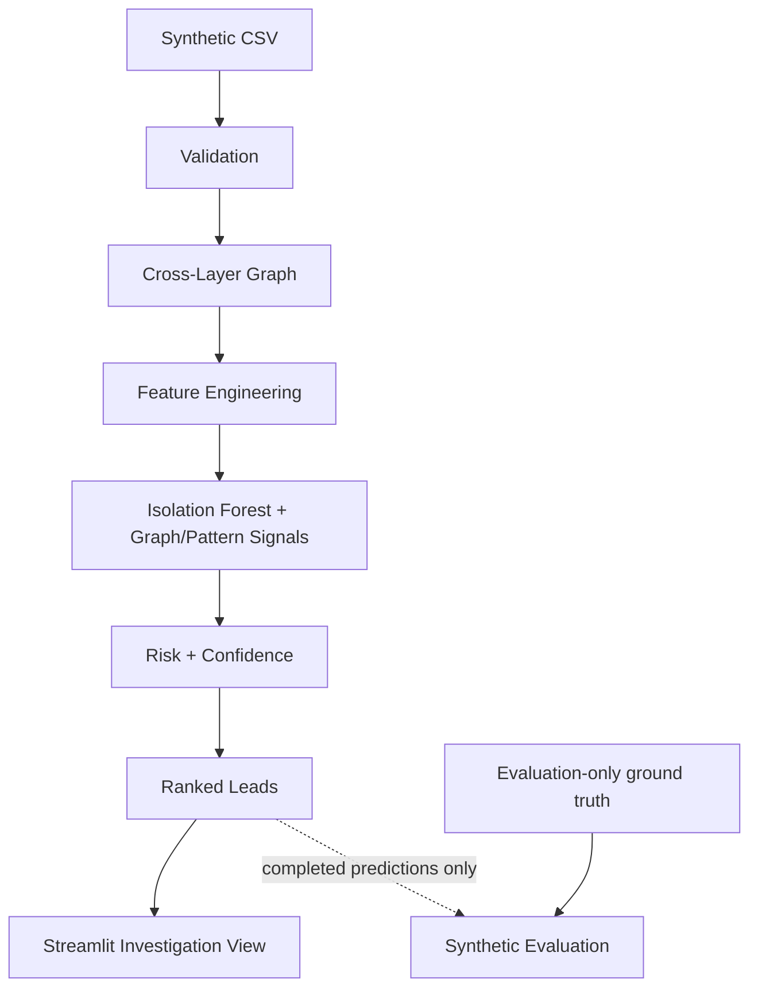

# TraceLayer

**Explainable Cross-Layer Bitcoin Traffic Intelligence**

A small, local SIH 2026 proof-of-concept built with Python and Streamlit.
The included case, **Operation Meridian**, is entirely synthetic.

## Problem

Bitcoin investigations can involve two different evidence layers:

- P2P/network metadata: IP addresses, ports, and timestamps.
- Blockchain metadata: transaction IDs, wallet addresses, and amounts.

Investigators need to correlate these observations, inspect transaction patterns,
and prioritize leads for review. Correlation does not identify a real person or
establish that an observed IP owns a wallet.

## Prototype Scope

Implemented in this SIH proof-of-concept:

- CSV ingestion and validation, with rejected-row reporting.
- Cross-layer NetworkX evidence graph.
- Wallet feature engineering and Isolation Forest anomaly detection.
- Conservative peeling-chain heuristic and seed-risk graph proximity.
- Separate risk and confidence/evidence scoring.
- Explainable ranked leads and a three-tab Streamlit interface.
- Deterministic synthetic data generation and transparent synthetic evaluation.

**Future architecture, not implemented in this MVP:** DuckDB/Parquet scaling,
Redis/Celery distributed Linux workers, advanced entity clustering, CoinJoin-aware
clustering, SHAP-based explainability, and large-scale offline GeoIP/ASN enrichment.
No authentication, external databases, live collection, cloud APIs, or distributed
workers are included. Streamlit is the only application interface.

## Architecture



`run_pipeline()` returns cleaned data, the validation report, graph, numerical
features/scores, pattern indicators, and ranked leads. It does not load evaluation
labels. The UI calls this pipeline and caches its result by CSV content.

## Dataset

`data/demo_case.csv` contains 1,000 observations by default, generated with seed 42:

- 963 ordinary Bitcoin-like transactions spread across seven days.
- Five peeling-chain transactions across six continuation wallets, with amounts
  decreasing from 8.5 to 6.9 BTC and a smaller secondary output at each step.
- Thirty transactions from one burst wallet in 58 seconds.
- A two-transaction path from a supplied demonstration seed through an
  intermediate wallet to a target wallet.

No seized/private/live-intercept investigative data is included.
Wallets and TXIDs use visibly artificial identifiers such as `bc1q_demo_0001`
and `tx_demo_000001`. IPs use documentation ranges `192.0.2.0/24` and
`198.51.100.0/24`. The observations are illustrative associations, not packet captures.

Required columns:

```text
timestamp, src_ip, dst_ip, src_port, dst_port, txid,
input_addresses, output_addresses, input_amounts, output_amounts, fee, script_type
```

Addresses and amounts use JSON arrays inside CSV cells, never pipe-separated
strings. Amount entries are exact eight-decimal BTC strings. The generator uses
integer satoshis; ingestion converts amounts/fees to `Decimal`, timestamps to UTC
(naive timestamps are interpreted as UTC), and ports to integers. Each accepted
transaction balances inputs = outputs + fee. This is not a full UTXO ledger:
ordinary/burst transactions assume prior funding.

`load_case(path)` returns `(cleaned_dataframe, validation_report)`. It validates
required fields, nonempty aligned lists, IP syntax, port ranges, finite positive
amounts, nonnegative fees, timestamps, and balance. Invalid rows carry reasons
and one-based data-record numbers. The first valid TXID occurrence is retained;
later valid duplicates are rejected. `duplicate_txids` counts repeated nonblank
TXID occurrences across all input rows. `missing_required_values` counts blank
required cells, including absent-column cells. Blank data records are reported;
overwide CSV layouts and parser errors are explicitly rejected. Extra named
columns are ignored. For unreadable files, row totals are unknown and remain zero.

`ground_truth.json` is for evaluation and generator tests only. It never supplies
training labels or expected scores to the pipeline.

## AI/ML Approach

Isolation Forest learns which numerical activity profiles are relatively easy
to isolate in a set of randomized trees. Unsupervised detection is suitable for
this demonstration because the pipeline does not require labeled training data.
It finds unusual behavior; it does not classify criminal conduct.

The ten model features are:

| Feature | Definition |
|---|---|
| `transaction_count` | Distinct relevant TXIDs |
| `total_received`, `total_sent` | Wallet output/input BTC totals |
| `mean_transaction_amount`, `max_transaction_amount` | Mean/max gross sent + received BTC per relevant transaction |
| `unique_counterparties` | Distinct opposite-side wallets, excluding self; not proven direct payees |
| `incoming_degree`, `outgoing_degree` | Distinct neighboring TXID nodes by direction |
| `transaction_frequency` | `(count - 1) × 3600 / max(active span in seconds, 60)` |
| `mean_time_between_transactions` | Mean consecutive timestamp gap in seconds |

Single-transaction wallets have frequency zero and an undefined mean gap.
`seed_distance` is also computed for explanation/scoring, but is excluded from
the model. Entity names, IP strings, scenario labels, and ground truth are not
model features. Numeric missing/infinite values are median-imputed per column;
all-missing columns become zero. Empty, singleton, and constant cases return zero
anomaly scores rather than pretending to have learned useful distinctions.

The model uses 200 trees, `random_state=42`, and configurable `contamination=0.05`.
Contamination is a **demo parameter, not a calibrated real-world anomaly rate**.
It sets the model's outlier decision threshold, not the risk weights.

Scikit-learn `score_samples()` is **lower for anomalies**. TraceLayer negates it
and min-max normalizes within the case:

```text
raw = -score_samples(features)
anomaly_score = (raw - min(raw)) / (max(raw) - min(raw))
```

A constant range becomes zero. Higher scores are more anomalous; scores are not
probabilities and are not directly comparable between independently fitted cases.
Fitting and scoring this same small synthetic case is not held-out validation.

## Graph Analysis

A `MultiDiGraph` preserves parallel evidence edges. Node keys are `(node_type, id)`
tuples; attributes include `id`, `node_type`, and `risk_seed`.

- `IP → TXID`: `associated_with`, with timestamp, port, endpoint role, and
  `evidence_only=True`.
- `WALLET → TXID`: `input_to`, with timestamp and BTC amount.
- `TXID → WALLET`: `output_to`, with timestamp and BTC amount.

**Network observations are supporting evidence and are not treated as proof of
wallet ownership or user identity.**

The user-specified `seed_wallet_demo` is an explicit, configurable graph seed,
not a learned detection or a hidden target label. Directed seed distance uses
only wallet/TXID links; IP correlations cannot create shortcuts. Two graph edges
represent one wallet-to-wallet transfer. Paths express structural associations,
not proven coin provenance; seed path search does not enforce chronological order.

The peeling indicator requires at least three chronological steps by default.
Each step has one input, two distinct outputs, and a continuation output holding
at least 80% of output value. Consecutive steps must match the prior continuation
amount to the next input, decrease by at most 20%, and move to a new wallet.
Ambiguous branches and cycles stop extension. Continuation wallets on a qualifying
chain receive a binary signal of 1 and a chain-length explanation. Others receive
0. These parameters are configurable. Ordinary change behavior can match; real
patterns with multiple inputs may be missed. This is an indicator, not a finding
of money laundering. Names play no part in the heuristic.

## Risk vs Confidence

**Risk = prioritization score. Confidence = supporting-evidence strength.**

```text
seed_proximity = 1 / (1 + directed_seed_distance / 2)
                or 0 when unreachable
risk = 100 × (0.50 × anomaly + 0.30 × peeling + 0.20 × seed_proximity)
```

Weights are commented constants in `scoring.py`, chosen for demonstration rather
than fitted or calibrated. All wallets remain ranked; ties use entity ID.

Confidence has three independent evidence terms:

```text
40 points if both blockchain and network evidence are available
+ 40 × min(distinct relevant transactions / 10, 1)
+ 20 × min(repeated same-IP transactions beyond the first / 3, 1)
```

The repetition term uses the maximum across associated IPs. Confidence ignores
anomaly, seed, pattern, and risk values. `evidence_count` counts distinct TXIDs;
IP/transaction associations are not independent packet captures. Repetition
across different transactions is not verified corroboration of ownership.

Confidence is **not a probability of criminality**. Display it as, for example,
`Confidence score: 86/100`.

## Explainability

Each lead includes reasons based on computed values: the Isolation Forest score
and outlier decision, qualifying peeling-chain length, seed distance when
reachable, transaction counts, and observed IP repetition where present.
These are signal explanations, not SHAP feature attributions or causal findings.
Reasons are Python lists in memory and JSON arrays in `ranked_leads.csv`.

The interface contains exactly three views: **Case Overview**, **Ranked Leads**,
and **Evidence Graph / Lead Details**. It supports risk filtering, literal entity
search, selected-lead explanations, typed graph nodes, and evidence tables.
Large graph drawings show at most 180 nearest nodes with an explicit notice;
the underlying analysis and tables remain complete. Parallel edges overlap in
the drawing but remain distinct in the graph.

## Running Locally

Requires Python 3.11+ and a local terminal. Clone the repository using your GitHub
access, then run commands from the repository root:

```sh
git clone https://github.com/samarthya-06/TraceLayer.git
cd TraceLayer
python -m venv .venv
```

Activate on macOS/Linux:

```sh
source .venv/bin/activate
```

Activate on Windows PowerShell:

```powershell
.venv\Scripts\Activate.ps1
```

Or on Windows Command Prompt:

```bat
.venv\Scripts\activate.bat
```

Install and run:

```sh
python -m pip install -r requirements.txt
python scripts/generate_demo_data.py
python -m tracelayer.pipeline
python scripts/evaluate_demo.py
streamlit run app.py
```

Use `python3` instead of `python` when needed before activating the environment.
The generator accepts `--rows` (minimum 100) and `--seed`. The pipeline accepts
`--case`, `--output`, and `--contamination`. After changing case parameters,
regenerate predictions before evaluating; do not evaluate a stale ranked CSV.
The UI computes current results in memory; the pipeline CLI saves the ranked CSV.

Installation needs package downloads or a prepared package cache. Once installed,
analysis and UI work locally without cloud APIs. Usage telemetry is disabled in
`.streamlit/config.toml`. Open the localhost URL printed by Streamlit and use
Ctrl+C to stop. No machine-specific paths or credentials are required.

Tests and optional inspection commands:

```sh
python -m unittest discover -s tests -v
python -m scripts.inspect_anomalies
python -m scripts.inspect_graph
python -c "import streamlit; print(streamlit.__version__)"
```

Direct dependencies are pandas (tables/ingestion), numpy (numeric cleanup),
scikit-learn (Isolation Forest), NetworkX (graphs), Streamlit (UI), and Plotly
(local graph rendering). No other direct libraries are required. Tests use
standard-library `unittest` and Streamlit's bundled testing API.

The recorded results use Python 3.14.6, pandas 3.0.6, numpy 2.5.3,
scikit-learn 1.9.1, NetworkX 3.7, Streamlit 1.64.0, and Plotly 7.1.0.
Requirements specify minimum APIs rather than a complete dependency lock.
Package versions may affect exact rankings. Python 3.11 and Windows are supported
by the project design but have not been exercised in the recorded macOS test run.

## Synthetic Evaluation

**Synthetic Demo Results** — generated by `scripts/evaluate_demo.py`, saved in
`data/evaluation.json`, and based on the combined risk ranking, not standalone
model classification accuracy.

The evaluator loads and validates completed ranked predictions **before** reading
`ground_truth.json`. It never calls training or changes scores. Primary targets
are six peeling continuation wallets, the burst source, and the seed-path target.
Incidental recipients and the supplied seed are excluded from that primary set;
a broader participant check is reported alongside it to expose that choice.

| Metric | Actual result |
|---|---:|
| Total ranked entities | 645 |
| Primary planted targets | 8 |
| Top 5% cutoff (`ceil(645 × .05)`) | 33 |
| Targets in top 5% / Recall@5% | 8/8 / 100% |
| Top 10% cutoff (`ceil(645 × .10)`) | 65 |
| Targets in top 10% / Recall@10% | 8/8 / 100% |
| Mean rank of primary targets | 6.125 |
| Missing primary targets | 0 |
| All-participant Recall@5% | 10/45 / 22.22% |
| All-participant Recall@10% | 10/45 / 22.22% |

Individual primary ranks:

| Entity | Combined risk rank |
|---|---:|
| wallet_peel_01 | 5 |
| wallet_peel_02 | 1 |
| wallet_peel_03 | 2 |
| wallet_peel_04 | 3 |
| wallet_peel_05 | 4 |
| wallet_peel_06 | 6 |
| wallet_burst_demo | 7 |
| wallet_target | 21 |

Missing targets count against recall; mean rank includes found targets only and
missing IDs are listed. Input-file SHA-256 fingerprints identify evaluated files,
but do not prove that an arbitrary supplied prediction file matches its labels.
The burst wallet is 5th by anomaly alone, and 7th by combined risk. No model or
scoring changes were made to improve these evaluation metrics.

The wider participant recall is low because incidental recipient wallets mostly
have single, unremarkable transactions. The primary targets were deliberately
planted with conspicuous structure, and seed proximity uses a supplied seed.
Legitimate next steps are more diverse normal/change behavior, independent cases,
and larger public/synthetic evaluation sets—not scenario-name rules.

**The evaluation measures ranking performance on seeded synthetic scenarios.
It is not evidence of real-world investigative accuracy.**

The final audit and its checks are recorded in [AUDIT.md](AUDIT.md). All 29 tests
passed in a fresh clone with a newly installed environment; regenerated data,
predictions, and evaluation matched the tracked artifacts byte-for-byte.

## Limitations

- Synthetic, small dataset and eight primary targets; neither representative nor
  a held-out operational benchmark. No real-world accuracy claim is supported.
- Simplified network/blockchain correlation: one synthetic observation per TXID;
  duplicate TXIDs are rejected, so repeated real P2P observations are not modeled.
- Heuristic peeling detection; ordinary change can match, and complex chains can
  be missed. No UTXO provenance, CoinJoin safeguards, or real-identity inference.
- Isolation Forest is not calibrated on operational ground truth. Scores are
  case-relative and sensitive to feature distributions and dependency versions.
- Risk/confidence scores are investigative prioritization aids, not probabilities.
  Network repetition alone is not independent evidence of identity.
- Graph paths are structural; seed distance does not enforce time ordering.
- No forensic chain of custody, live collection, authentication, or scale testing.
  **Not production forensic software.**

## SIH Roadmap

Future work could explore DuckDB/Parquet storage, offline GeoIP/ASN context,
better Bitcoin clustering with CoinJoin-aware safeguards, larger synthetic/public
datasets, SHAP explanations, and stronger evidence provenance. Distributed Linux
workers using Redis/Celery are a possible later scaling architecture, not part of
this implementation. Each extension requires separate validation and scope review.

## Repository Structure

```text
TraceLayer/
├── .gitignore
├── .streamlit/config.toml        # Theme and disabled usage telemetry
├── README.md
├── AUDIT.md                     # Final technical review and reproducibility checks
├── app.py                       # Three-tab UI, using the pipeline
├── requirements.txt
├── data/
│   ├── demo_case.csv
│   ├── ground_truth.json        # Evaluation-only labels
│   ├── ranked_leads.csv         # Generated predictions
│   └── evaluation.json          # Generated synthetic evaluation
├── scripts/
│   ├── generate_demo_data.py
│   ├── evaluate_demo.py
│   ├── inspect_anomalies.py
│   └── inspect_graph.py
├── tracelayer/
│   ├── __init__.py
│   ├── ingestion.py
│   ├── graph_builder.py
│   ├── features.py
│   ├── anomaly.py
│   ├── patterns.py
│   ├── scoring.py
│   └── pipeline.py
└── tests/
    ├── test_generate_demo_data.py
    ├── test_ingestion.py
    ├── test_graph_builder.py
    ├── test_anomaly.py
    ├── test_pipeline.py
    ├── test_app.py
    └── test_evaluation.py
```

Optional inspection scripts are retained because they provide focused,
reproducible demonstrations. Virtual environments, caches, local secrets, and
machine-specific files are excluded from version control.

## Disclaimer

TraceLayer is an investigation-support prototype.
Flags indicate prioritization signals, not determinations of criminal activity.
Final interpretation remains with the human investigator.
